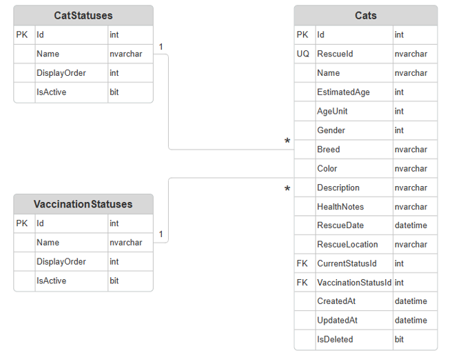

# NineLives.API — System Design

> Version 1.0 (MVP)

This document describes the overall system design of **NineLives.API**, including its architecture, domain model, database design, API structure, and implementation approach.

---

# Table of Contents

1. Introduction
2. Design Goals
3. System Architecture
4. Domain Model
5. Reference Data
6. Database Design
7. API Design
8. Project Structure
9. Summary

---

# 1. Introduction

## Purpose

NineLives.API is a RESTful Web API developed using ASP.NET Core.

The purpose of this document is to describe the overall technical design before implementation begins.

## Scope

Included:

- Architecture
- Domain Model
- Database Design
- API Design
- Project Structure

Excluded:

- User Interface (UI)

---

# 2. Design Goals

| Goal					 | Description				|
|------------------------|--------------------------|
| Maintainability		 | Code easy to maintain	|
| Separation of Concerns | Separate responsibilities|
| Scalability			 |	 Easy to extend			|
| Simplicity			 | Suitable for MVP			|
| RESTful Design		 | Standard REST principles	|

---

# 3. System Architecture

## Layered Architecture

```text
Client
   │
   ▼
Controllers
   │
   ▼
Services
   │
   ▼
Repositories
   │
   ▼
SQL Server
```

## Controller Layer

Responsibilities

- Receive HTTP requests
- Validate request models
- Return responses

## Service Layer

Responsibilities

- Business logic
- Generate Rescue ID
- Duplicate validation
- Soft Delete

## Repository Layer

Responsibilities

- CRUD
- Entity Framework Core

## Database Layer

Responsibilities

- Persist data
- Foreign Keys
- Constraints

---

# Request Flow

```text
Client
   │
   ▼
Controller
   │
   ▼
Service
   │
   ▼
Repository
   │
   ▼
SQL Server
```

---

# Technology Stack

| Component | Technology |
|-----------|------------------------|
| Framework | ASP.NET Core (.NET 10) |
| Language	| C#					 |
| ORM		| Entity Framework Core  |
| Database  | SQL Server			 |
| API Docs  | Swagger				 |
| IDE		| Visual Studio 2026	 |

---

# 4. Domain Model

## Cat Entity

| Field				  | Description		  |
|---------------------|-------------------|
| Id				  | Internal PK		  |
| RescueId			  | Public Identifier |
| Name				  | Optional		  |
| EstimatedAge		  | Age				  |
| AgeUnit			  | Enum			  |
| Gender			  | Enum			  |
| Breed				  | Optional		  |
| Color				  | Required		  |
| Description		  | Optional		  |
| HealthNotes		  | Optional		  |
| RescueDate		  | Required		  |
| RescueLocation	  | Required		  |
| CurrentStatusId	  | FK				  |
| VaccinationStatusId | FK				  |
| CreatedAt			  | Timestamp		  |
| UpdatedAt			  | Timestamp		  |
| IsDeleted			  | Soft Delete		  |

---

# Business Identifier

## Id

- Internal Primary Key
- Auto Increment
- Never exposed

## RescueId

Example

```text
CAT-20260001
CAT-20260002
CAT-20260003
```

---

# 5. Reference Data

## Enumerations

### Gender

- Male
- Female
- Unknown

### Age Unit

- Week
- Month
- Year

## Lookup Tables

### Cat Status

- Rescued
- Under Treatment
- Fostered
- Ready for Adoption
- Adopted
- Deceased

### Vaccination Status

- Unknown
- Not Vaccinated
- Partially Vaccinated
- Vaccinated

---

# 6. Database Design

## Database Overview

| Table				  | Purpose		|
|---------------------|-------------|
| Cats				  | Main Entity |
| CatStatuses		  | Lookup		|
| VaccinationStatuses | Lookup		|

## Entity Relationship Diagram



## Table Design

### Cats

| Column	| Type	   | Req.	|
|-----------|----------|:------:|
| RescueId  | nvarchar | ✅		|
| Name		| nvarchar | ❌		|
| ...		| ...	   | ...	|

...

---

# 7. API Design

## Endpoints

| Method| Endpoint			   |
|-------|----------------------|
| POST	| /api/cats			   |
| GET	| /api/cats			   |
| GET	| /api/cats/{rescueId} |
| PUT	| /api/cats/{rescueId} |
| DELETE| /api/cats/{rescueId} |

## Sample Request

```json
{
  "name": "Milo",
  "gender": "Male"
}
```

## Sample Response

```json
{
  "rescueId": "CAT-20260001",
  "message": "Cat registered successfully."
}
```

---

# 8. Project Structure

```text
NineLives.API
│
├── Controllers
├── Services
├── Repositories
├── Models
│   ├── Entities
│   ├── Requests
│   └── Responses
├── Data
├── Common
├── Migrations
└── Program.cs
```

---

# 9. Summary

NineLives.API follows a layered architecture with RESTful principles, SQL Server, Entity Framework Core, and soft deletion to provide a maintainable foundation for the MVP.